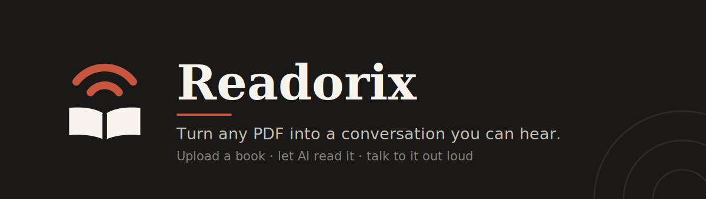
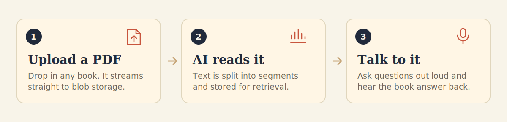

<p align="center">
  
</p>

<p align="center">
  
  
  
  
  
</p>

---

## What is Readorix?

Readorix turns the books you already own into something you can **talk to**.

Upload a PDF and Readorix reads it for you — not as flat text-to-speech dictation, but as a voice you can interrupt. Ask what a chapter argued. Ask it to explain a passage again, slower. It answers out loud, grounded in the actual text of *your* book.

It's built for the times reading isn't an option: commuting, walking, cooking, or just too tired to focus on a page.

<p align="center">
  
</p>

---

## Current status

> **Early development.** The foundations work end to end; the reading experience is still being wired up.

| Area | State |
|---|---|
| Sign-in / sign-up (Clerk) | ✅ Working |
| PDF upload → Vercel Blob | ✅ Working — client-side upload with scoped, server-issued tokens |
| Book + segment persistence (MongoDB) | ✅ Schemas and server actions in place |
| Library homepage | ⚠️ Renders a hardcoded `sampleBooks` list, not your uploads |
| Book detail page (`/books/[slug]`) | ❌ Not built — book cards currently link to a 404 |
| Voice conversation | ⚠️ `VapiControls`, `Transcript`, `VoiceSelector` and `useVapi` are written but not yet mounted on a route |
| Subscriptions / billing | ⚠️ Constants and server guards exist; no checkout flow |

If you're cloning this to try it: you can sign up and upload a book today, but you can't listen to one yet.

---

## Tech stack

| Layer | Choice |
|---|---|
| Framework | Next.js 16.2 (App Router, Server Actions) |
| UI | React 19, Tailwind CSS v4, shadcn/ui, Base UI |
| Auth | Clerk (`@clerk/nextjs` v7) |
| Database | MongoDB via Mongoose 9 |
| File storage | Vercel Blob (client uploads) |
| Voice | Vapi (`@vapi-ai/web`) |
| PDF parsing | `pdfjs-dist` |
| Forms / validation | React Hook Form + Zod |
| Notifications | Sonner |

---

## Getting started

### Prerequisites

You'll need accounts for **Clerk**, **MongoDB** (Atlas or local), **Vercel Blob**, and **Vapi**. All four have free tiers that cover local development.

### Install

```bash
git clone git@github.com:rebel600/readorix.git
cd readorix
npm install
```

### Configure

Create a `.env.local` in the project root:

```bash
# Clerk — dashboard.clerk.com → API Keys
NEXT_PUBLIC_CLERK_PUBLISHABLE_KEY=pk_test_...
CLERK_SECRET_KEY=sk_test_...

# MongoDB — Atlas connection string, or mongodb://localhost:27017/readorix
MONGODB_URI=mongodb+srv://...

# Vercel Blob — Vercel dashboard → Storage → Blob → Tokens
BLOB_READ_WRITE_TOKEN=vercel_blob_rw_...

# Vapi — dashboard.vapi.ai
NEXT_PUBLIC_VAPI_API_KEY=...
NEXT_PUBLIC_ASSISTANT_ID=...
```

> `.env*` is gitignored. Never commit real keys — and note that `NEXT_PUBLIC_*` values are exposed to the browser by design, so only publishable keys belong behind that prefix.

### Run

```bash
npm run dev     # http://localhost:3000
npm run build   # production build
npm run lint    # eslint
```

Optionally, install the Clerk agent skills for help with auth work:

```bash
npx skills add clerk/skills
```

---

## Project structure

```
app/
  (root)/books/new/    Upload page — guarded with auth.protect()
  api/upload/          Issues scoped Vercel Blob client-upload tokens
  sign-in/, sign-up/   Clerk catch-all routes
  icon.svg             App icon
components/            UI + feature components (upload, voice, transcript)
  ui/                  shadcn primitives
database/
  models/              Mongoose schemas: book, book-segment, voice-session
  mongoose.ts          Cached connection helper
hooks/useVapi.ts       Voice session lifecycle
lib/
  actions/             Server actions (book, session)
  constants.ts         Brand colors, sample books, upload limits
  zod.ts               Validation schemas
proxy.ts               Clerk middleware mount
```

### A note on `proxy.ts`

In this version of Next.js the middleware file is named **`proxy.ts`**, not `middleware.ts`.

It mounts `clerkMiddleware()` but deliberately does **no route matching** — authentication is enforced per resource instead, via `auth.protect()` in pages and an explicit `auth()` check in the upload route. The tradeoff is worth knowing: this is no longer deny-by-default, so **any new protected page must add its own check.** Forgetting one fails open, silently.

---

## Data model

```
Book                          BookSegment                VoiceSession
├─ clerkId    (owner)         ├─ bookId                  ├─ bookId
├─ title / slug / author      ├─ segment text            ├─ clerkId
├─ persona                    └─ ordering                └─ transcript
├─ fileURL + fileBlobKey
├─ coverURL + coverBlobKey
├─ fileSize
└─ totalSegments
```

Every record is scoped by `clerkId`, so a user only ever reads their own library.

---

## Contributing

The most useful things to pick up right now are the gaps in the status table — particularly the `/books/[slug]` page, which is what unblocks the voice experience everything else is built to support.

Branch off `main`, keep `npx tsc --noEmit` clean, and open a PR.
